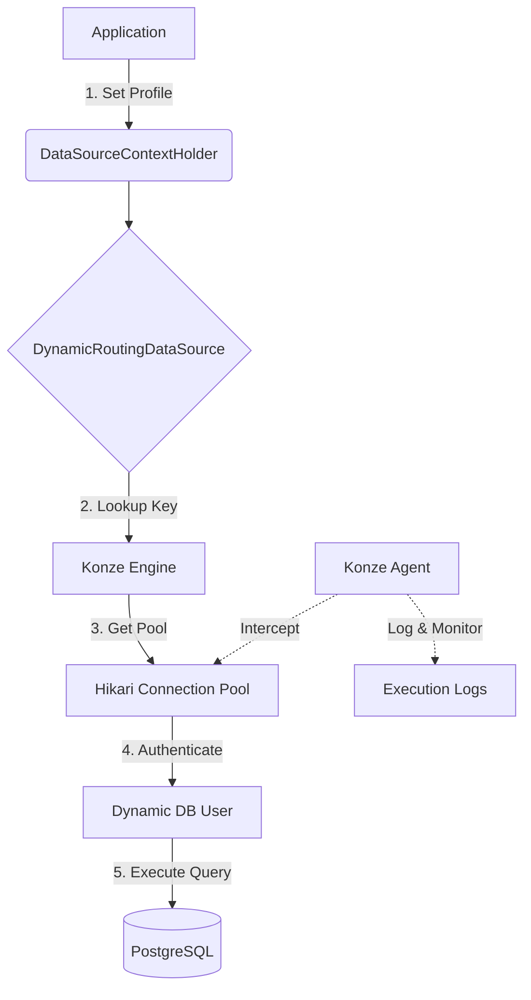

# Konze 🐘

**Konze** is a robust database connection management framework for Java and Kotlin applications. It is designed to provide granular control, enhanced security, and superior observability, making it especially powerful for modern **AI agent platforms** and multi-tenant architectures.

Whether you need to enforce strict query timeouts, manage dynamic database permissions, or expose schema metadata for Text-to-SQL tasks, Konze provides a seamless, profile-based approach.

---

## 🚀 Key Features

| Feature | Description | Status |
| :--- | :--- | :--- |
| **Dynamic Permissions** | Manage database users and privileges on-the-fly based on application profiles. | ✅ Done |
| **Resource Guarding** | Enforce strict query execution timeouts and connection pool limits per profile. | ✅ Done |
| **Deep Observability** | Integrated query logging and slow query monitoring at the driver level. | ✅ Done |
| **AI-Ready Metadata** | Structured schema discovery endpoints for Text-to-SQL and LLM context. | ✅ Done |
| **Spring Boot Support** | Auto-configuration for dynamic routing data sources and profile switching. | ✅ Done |
| **PostgreSQL Support** | Native integration for PostgreSQL administration and schema discovery. | ✅ Done |
| **Data Historization** | Automatic auditing and recovery mechanisms for database changes. | 🚧 In Progress |
| **Multi-DB Support** | Extending support to MySQL and other major relational databases. | 📅 Planned |

---

## 🛠 Why Konze?

Modern applications—especially those integrating **Large Language Models (LLMs)**—face new challenges in database management:

1.  **Security First**: AI agents should never have `all privileges`. Konze allows you to define exactly what an agent can do (e.g., `select` only on specific tables) by dynamically creating restricted database users.
2.  **Stability & Safety**: A runaway AI-generated query can easily overwhelm your database. Konze enforces execution timeouts to ensure system stability.
3.  **Full Auditability**: Every query executed through Konze can be logged with high detail, providing a clear audit trail of what your application (or its agents) are doing.
4.  **Seamless Discovery**: AI agents need to understand the database schema. Konze exposes this information through a structured discovery API.

---

## 🏗 How it Works

Konze acts as a middleware between your application and the database. It manages a registry of database contexts, each containing one or more connection profiles.

### The Flow


---

## 🧩 Core Concepts

### Database Context
A **Context** represents a single logical database instance (e.g., your production CRM or a staging environment). It contains the administrative credentials required to manage users and schemas.

### Connection Profiles
A **Profile** is a specific set of rules for interacting with a context. Each profile defines:
- **Permissions**: The SQL privileges (e.g., `select`, `insert`) that will be granted to the dynamic user.
- **Resource Limits**: Pool sizes and execution timeouts.
- **Observability**: Whether and where to log queries and slow-running operations.

### Dynamic User Management
When a profile is activated, Konze ensures a database user exists with the exact permissions defined for that profile. This follows the **Principle of Least Privilege**, ensuring that even if an application layer is compromised (e.g., via prompt injection in an AI agent), the database damage is strictly limited.

---

## 📦 Project Structure

- **`konze-core`**: The backbone of the framework. It handles the YAML configuration parsing, HikariCP pool lifecycle management, and the `DatabaseAdministrationManager`.
- **`konze-agent`**: A specialized module that provides interceptors for `java.sql.Statement` and `PreparedStatement`. It enables real-time monitoring and query logging without modifying your application logic.
- **`konze-driver-postgres`**: Implements the `DatabaseDriver` and `SchemaDiscovery` interfaces specifically for PostgreSQL. It knows how to grant permissions and extract metadata using Postgres-native queries.
- **`konze-spring-boot-starter`**: Provides the "magic" for Spring Boot. It auto-configures the `Engine`, registers the `DynamicRoutingDataSource`, and sets up the `SchemaDiscoveryController` to expose your database metadata via REST.

---

## 🌟 Common Use Cases

### 1. AI Agent Security
When building an LLM-powered agent that can query your database, Konze ensures that the agent only has `select` access to the necessary tables, preventing malicious or accidental data modification.

### 2. Multi-Tenant Applications
Isolate customer data by using separate profiles or even separate database contexts, all managed through a single, unified `DynamicRoutingDataSource`.

### 3. Resource-Intensive Batch Jobs
Define a "batch" profile with a long execution timeout and a small connection pool to ensure background tasks don't starve your interactive application of database resources.

---

## 🤖 AI & Text-to-SQL Integration

Konze is built for the era of AI. It provides a built-in **Schema Discovery API** that allows your agents to understand the database structure before generating queries.

### Enabling Discovery
In your profile configuration:
```yaml
schemaDiscoveryEndpoint:
  enabled: true
  endpoint: /api/v1/schema-discovery
  rateLimiting: 100
```

Your agent can then fetch the schema as a structured JSON object, providing the necessary context for high-accuracy Text-to-SQL generation.

---

## 🏁 Getting Started

### 1. Add Dependencies

Add Konze to your `build.gradle.kts`:

```kotlin
dependencies {
    implementation("net.master-studios:konze-spring-boot-starter:0.1.0")
    implementation("net.master-studios:konze-driver-postgres:0.1.0")
}
```

### 2. Configure Your Connections

Define your database contexts and profiles in a YAML specification (e.g., `konze-spec.yaml`):

```yaml
  konze:
    databaseAdministration:
      access:
        driver: net.masterstudios.konze.driver.postgres.PostgresDatabaseDriver
        jdbcUrl: jdbc:postgresql://localhost:5432/my_db
        username: admin_user
        password: admin_password
    profiles:
      read-only-agent:
        permissions:
          - select
        configuration:
          query:
            executionTimeout: 30s
            executionLogging: true
            executionLog: ./logs/agent-queries.log
        pool:
          maximumPoolSize: 5
          jdbcUrl: jdbc:postgresql://localhost:5432/my_db
```

### 3. Usage in Spring Boot

Konze automatically configures a `DynamicRoutingDataSource`. You can switch profiles using the `DataSourceContextHolder`:

```kotlin
import net.masterstudios.konze.spring.DataSourceContextHolder
import org.springframework.jdbc.core.JdbcTemplate
import org.springframework.stereotype.Service

@Service
class AgentService(
    private val jdbcTemplate: JdbcTemplate,
    private val userRepository: UserRepository // Standard Spring Data Repository
) {

    fun executeAgentTask(query: String) {
        try {
            // Switch to the restricted agent profile
            DataSourceContextHolder.setDataSourceType("read-only-agent")
            
            // All operations here will use the 'read-only-agent' connection.
            // This works for low-level JdbcTemplate:
            jdbcTemplate.execute(query)

            // AND for high-level Spring Data Repositories:
            val users = userRepository.findAll()
            
        } finally {
            // Always clear the context after use
            DataSourceContextHolder.clearDataSourceType()
        }
    }
}
```

---

## ⚙️ Configuration Reference

### Permissions
Konze supports granular database permissions:
- `select`, `insert`, `update`, `delete`, `truncate`
- `references`, `trigger`, `maintain`, `usage`, `create`, `connect`, `temporary`, `execute`
- `all privileges`

### Monitoring & Logging
```yaml
configuration:
  query:
    executionTimeout: 60s
    executionLogging: true
    executionLog: ./logs/execution.log
  monitoring:
    slowQueryThreshold: 500 # milliseconds
    slowQueryLogging: true
    slowQueryLog: ./logs/slow-queries.log
```

---

## 🤝 Contributing

We welcome contributions! Whether it's reporting a bug, suggesting a feature, or submitting a Pull Request, your help is appreciated.

1.  Fork the repository.
2.  Create a feature branch.
3.  Commit your changes.
4.  Push to the branch.
5.  Create a new Pull Request.

---

## 📄 License

This project is licensed under the MIT License - see the [LICENSE](LICENSE) file for details.
